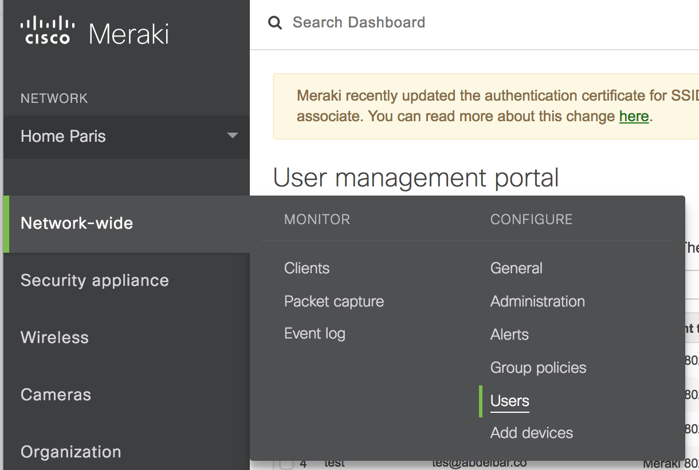
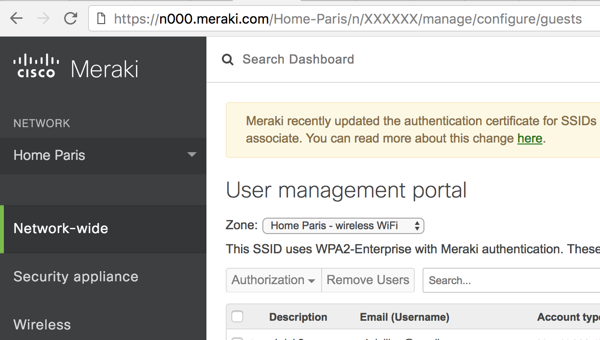

# Meraki users API

I worote this code to get access to the users interface in meraki dashbord in an API fashion, i also made a Swagger server to serve the result as actual REST API calls, the work is in prgress for now there is only one call in the API that will allow to get all the users in your network.


I worot a medium about it check it out [here!](https://medium.com/@aglagane/hacking-meraki-api-d0f5cd75612f)

# Install
for this project you will need the folwing python lebraries :
```
$ pip install requests,browsercookie,json
```

# Usage 

Donwload the code 
```
$ git clone https://github.com/Abdellbar/Meraki_users_API.git
```

Make sure to login to your dahsbord on the same computer you are dowloading the code to, using only *google chrome* fro now.


make note of your meraki dahsbord API genraly it will look somthing like this (copy only blue part)
`*https://n000.meraki.com/Home-Paris/n/XXXXXX/*manage/configure/guests`

Run the [get_envirenement.py](get_envirenement.py) file, it will create a [meraki_env.json](meraki_env.json) file. 
note : depending on your OS you my need some access rights when runing this code, on mac you will get a reqest to allow the process to access your chrome
```
$ python get_envirenement.py "https:// your dashbord meraki api here"
```

open the created meraki_env.json it should be in the folwing format :

```json
{
  "csrf_token": "XXXXXXXXXXXXXXXX",
  "my_cookie": "XXXXXXXXXXXXXXXX",
  "url_base": "XXXXXXXXXXXXXXXX"
}
```

Once the file is created and it has the data, you can go ahead and run the swagger server locally go [here](python-flask-server-generated/) for details

you can use Postman to test the swagger server and get access to your netwrk users, import the postman collection file [Meraki_users.postman_collection.json](Meraki_users.postman_collection.json) into your postman, copy the content of meraki_env.json and past it as json boday for your post reqest

# Contacts:

CISCO GVE 
Abdellbar@gmail.com

# Contrebutions:
Conterbutions welcomed, please feel free to pull the repo.

# Licence:
Please see [LICENSE](LICENSE).

24 February 2017


